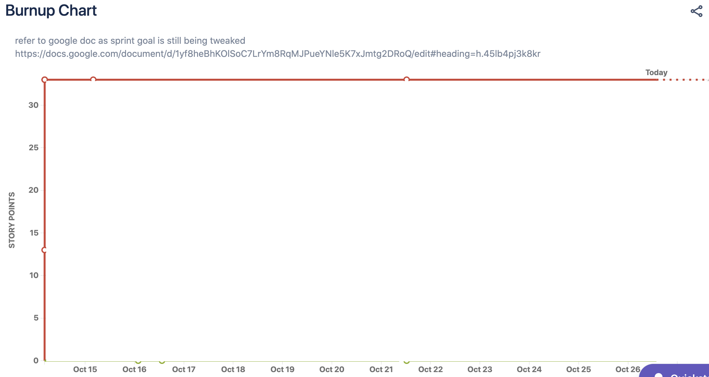
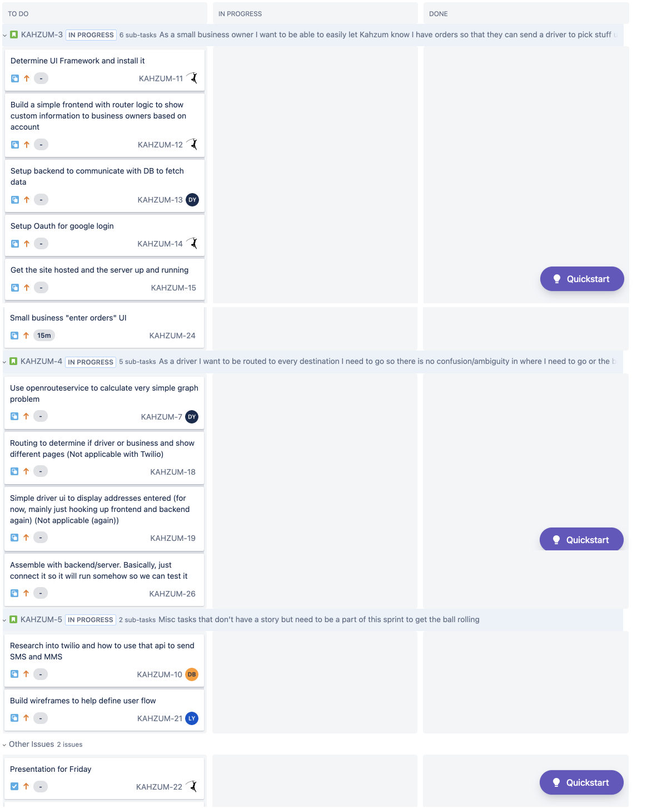

# Sprint 1 Plan

Kahzum Logistical App, October 13th, 2020

### **Sprint ends on October 28th, 2020**

## Goal

- Create the small business owner interface and research the routing script for drivers.

## Tasks for this sprint:

- As a small business owner I want to be able to easily let Kahzum know I have orders so that they can send a driver to pick stuff up. - Medium - 13

  - Determine UI Framework and install it

  - Build a simple frontend with router logic to show custom information to business owners based on account

  - Setup backend to communicate with DB

  - Setup Oauth for google login

  - Get the site hosted and the server up and running

- As a driver I want to be routed to every destination I need to go so there is no confusion/ambiguity in where I need to go or the best way to get there. - Medium - 20

  - Setup Oauth for google login

  - Routing to determine if driver or business and show different pages

  - Simple driver ui to display addresses entered (for now, mainly just hooking up frontend and backend again)

  - Look at current routing software and openrouteservice api

- Misc tasks that don’t have a story but need to be a part of this sprint to get the ball rolling

  - Research into twilio and how to use that api

  - Build wireframes to help define user flow

## Team Roles

- Product Owner: Mason

- Scrum Master: Daniel

- Team members: Aidan, David, Langqi

## Initial Task Assignments

- Mason: Define Architecture

- Aidan: Build ui for editing business

- Daniel: Setup backend and frontend

- David: Research how to do routing

- Langqi: Build wireframe

## Initial Burnup Chart

## Initial Scrum Board

## Scrum Times

### **TA Meeting: **

- Thursday, 2-2:45pm

### **Meetings: **

- Monday, 7:30pm

- Wednesday, 7pm

- Saturday, 7:30pm
