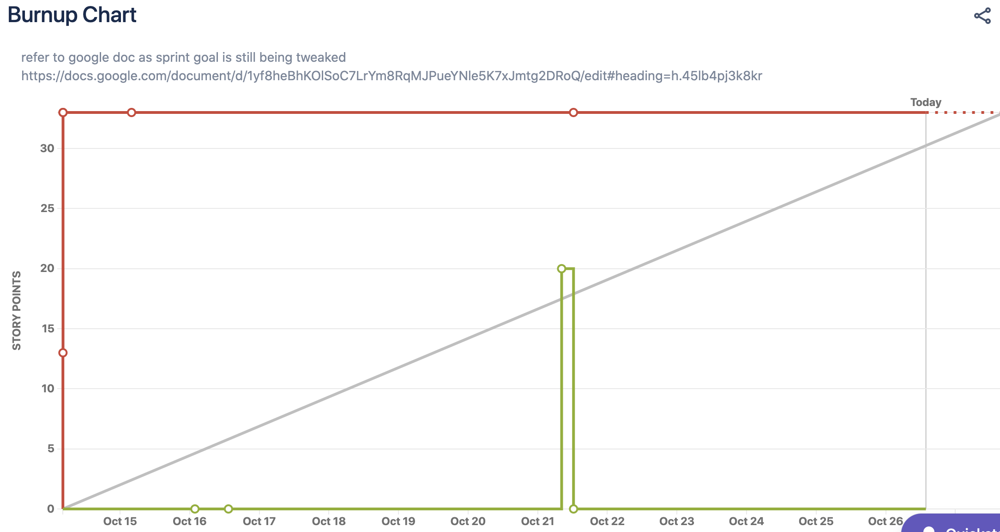

Sprint 1 Report

Kahzum Logistical App, October 26th, 2020

# Actions to stop doing:

- Stop pushing directly to main (master)

- Stop putting api keys directly in our repo(s)

# Actions to start doing:

- Using Jira more

  - Assign ourselves to tasks

  - Only move tasks to completed during scrum meeting

  - Add time estimates to Jira tasks

  - Log time spend (roughly)

- Think through tasks at the beginning of the sprint more thoroughly

- Include testing as a part of the development process - concurrently with development.

- Focus on building all the way through the architecture before making it more complicated

- Good documentation - For next sprint, make a documentation folder in the repository and have different \*.md files for each logical part. Update concurrently with coding

# Actions to keep doing

- Team communication is great

- Running meeting notes

- Meeting structure is informative to all members of the teams

# Work Completed/not completed

## Completed:

- Login with google (not acknowledged by backend) hosted on amplify (all changes to main are pushed to my.kahzum.com)

- Simple layout for inputting orders (not connected to backend)

- Basic Twilio set up (ready to develop on)

- Routing algorithm made (but not usable yet)

- Basic apis set up for backend

- Backend in a docker container

- Database is set up.

## Not Completed:

- Connect frontend to communicate with database

- Routing algorithm communicate with database

- Routing algorithm output

- Routing algorithm calling/hosting

- Backend needs to be deployed

# Work completion rate

- Total number of user stories completed: 1

- Total number of estimated ideal work hours: We didn’t do a good job tracking this, but we plan to do a better job in future sprints

- Since we did not do a good job of recording our hours, we don’t have a good estimate of ideal work hours/day

- See above bullet point for cumulative hrs/day

- 

- We know this burnup chart looks wrong, but we didn’t really know how to use jira correctly and log our hours. We will improve next sprint.

  - The red line is the desired user stories to complete based on story points

  - The green line is the completed user stories

  - The gray is the desired velocity of completion
