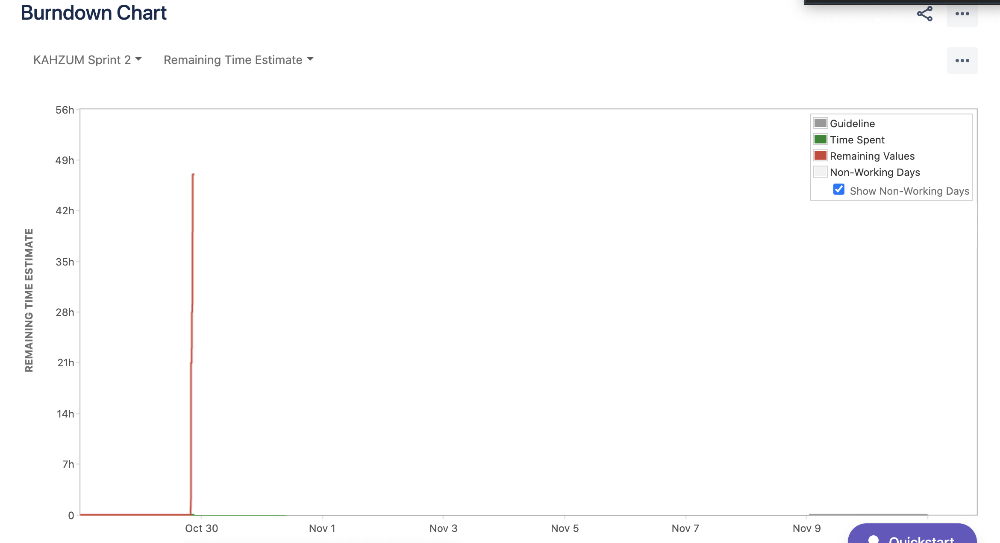
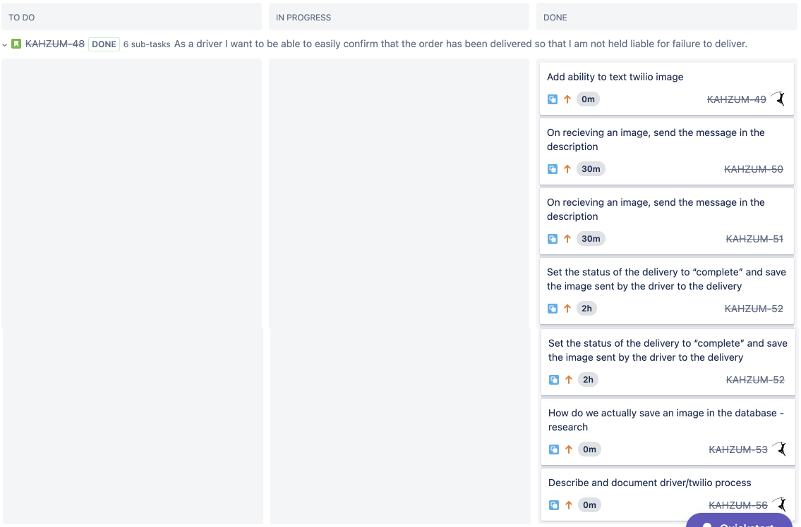

# Sprint 2 Plan

Kahzum Logistical App, October 28th, 2020

### Sprint ends on November 10th, 2020

## Goal

- Get the small business owner interface deployed so they can begin using it. Also try to get the risk out of the way for getting the routing algorithm working.

## Tasks for this sprint

- \*As a small business owner I want to be able to easily let Kahzum know I have orders so that they can send a driver to pick stuff up. - Medium - 13 -**\*_ HIGH_**

  - Complete user frontend in order to…

1. Add useEffect to handle side effects in function - learning associated with this. - **Mason**

2. Improve UI for entering into textboxes -> add and remove textboxes from list.

- \*As a small business I want to be able to save my daily orders and see confirmation that it was saved successfully so I can show a driver that I have a/an order(s) to pick up. -**\*_ HIGH_**

  - On save, put orders in database **Langqi & David**

  - change the state of the textboxes somehow…

  - confirm when the order is saved successfully (loading)

- \*As a small business owner, I want to be able to see my order status for today so that I know when to expect pickup/delivery. - **\*_ HIGH_**

  - UI for todays orders should auto fill already entered orders if they leave the page and come back (from backend)

- \*As a small business owner, I want Kahzum to save my information so that I don't have to type in everytime (User login/Register into DB) - **\*_ HIGH_**

  - When logging in with google, communicate with backend,

  - Implement sidebar - **Daniel**

  - Direct user to business information login when they log in for the **first time**

  - Build Ui for editing business information - **Aidan, meet up with mason**

  - Connect business information ui to backend to save/pull

- \*As a driver, when it is my time to drive, I want to be given directions so that I know where to go to pick up and drop off. - **\*_ Medium _**

  - Define inputs to python and make output in a friendly format (and define what that is)

  - Integrate python with either api using davids plugin or run it on separate container

  - Create google map link for each driver (what did we decide to do here again? I think we are giving them all 10 waypoints as a google maps url in the text right?)

  - Text driver output of routing algorithm (google maps link)

- \*As a driver I want to be able to easily confirm that the order has been delivered so that I am not held liable for failure to deliver. - Medium - 13 - **\*_Medium_**

  - Add ability to text twilio image and it sends:

1. A message to the customer with the driver’s name, the small business’ name and the picture, like "Hi, this is {driver} from Kahzum! I just dropped off your order from {small business}. Thanks for supporting small businesses!", then an image that the driver sent.

2. A message to the driver with the confirmation that they delivered.

- Set the status of the delivery to "complete" and save the image sent by the driver to the delivery

- How do we actually save an image in the database - research

## Team Roles

- Product Owner: Mason

- Scrum Master: Aidan

- Team members: Daniel, David, Langqi

## Initial Task Assignments

- Mason: Learn how to use UseEffect()

- Aidan: Build ui for editing business

- Daniel: Implement sidebar

- David: save and put orders into db

- Langqi: save and put orders into db

## Initial Burnup Chart

## Initial Scrum Board

## Scrum Times

### **TA Meeting:**

- Thursday, 2-2:45pm

### Meetings:

- Monday, 7:30pm

- Wednesday, 7pm

- Saturday, 7:30pm
