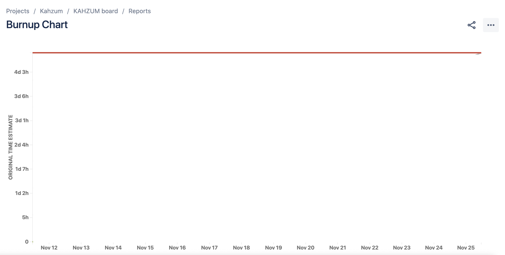
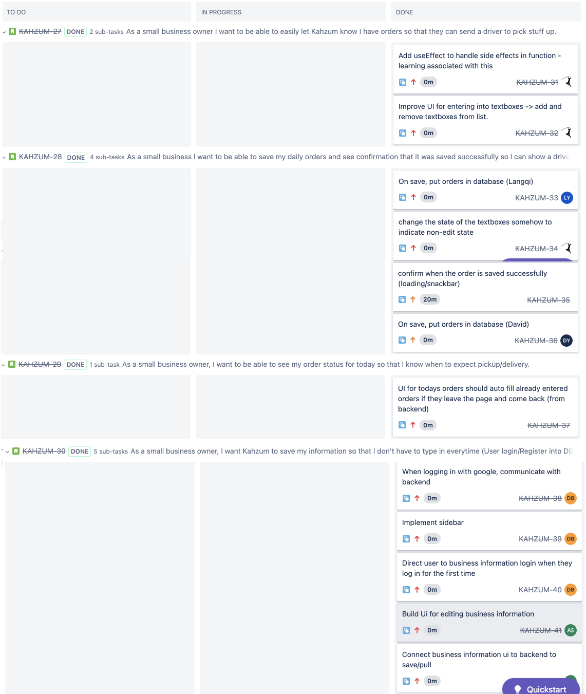

# Sprint 3 Plan

Kahzum Logistical App, November 11th, 2020

### **Sprint ends on November 24th, 2020**

## Goal

- Get the small business owner interface deployed and debugged, make major progress on twilio, and merge in routing algorithms.

## Tasks for this sprint

- \*As a driver, when it is my time to drive, I want to be given directions so that I know where to go to pick up and drop off. - **\*_ Medium _**

  - Create google map link for each driver (what did we decide to do here again? I think we are giving them all 10 waypoints as a google maps url in the text right?)

  - Text driver output of routing algorithm (google maps link)

  - Shell script to trigger routing every day at x time

  - twilio texts driver using mongo trigger when the routing script updates the database with that day’s route

  - handle "pickup" in twilio

  - retrofit "dropoff" in twilio

  - In routing script, figure out how to handle "locality"

    - Add locality fields to driver and business?

- \*As a small business owner I want to be able to easily let Kahzum know I have orders so that they can send a driver to pick stuff up. - Medium - 13 -**\*_ HIGH_**

  - Improve UI for entering into textboxes -> add and remove textboxes from list.

- \*As a small business I want to be able to save my daily orders and see confirmation that it was saved successfully so I can show a driver that I have a/an order(s) to pick up. -**\*_ HIGH_**

  - change the state of the textboxes somehow…

  - confirm when the order is saved successfully (loading)

- \*As a small business owner, I want to be able to see my order status for today so that I know when to expect pickup/delivery. - **\*_ HIGH_**

  - UI for todays orders should auto fill already entered orders if they leave the page and come back (from backend)

- As a small business owner, I want to be able to see my order history so that I have peace of mind regarding my deliveries. - **Medium**

  - Add the order history page to the frontend ui

  - Add the ability to fetch from the order history page from the backend api. Do a table that fetches for the "next page" on the table (so we don’t fetch the whole order history every time, just like 30 at a time or something.

  - The table should have a way to display the images to the owner (like maybe we could open a modal or something.

## Team Roles

- Product Owner: Mason

- Scrum Master: David

- Team members: Daniel, Langqi, Aidan

## Initial Task Assignments

- Mason: Improve ui for entering orders

- Aidan: Build ui for editing business

- Daniel: twilio texts to driver

- David: Add database infrastructure for saving routes

- Langqi: create google maps links

## Initial Burnup Chart

## Initial Scrum Board

## Scrum Times

### **TA Meeting: **

- Thursday, 2-2:45pm

### **Meetings: **

- Monday, 7:30pm

- Wednesday, 7pm

- Saturday, 7:30pm
