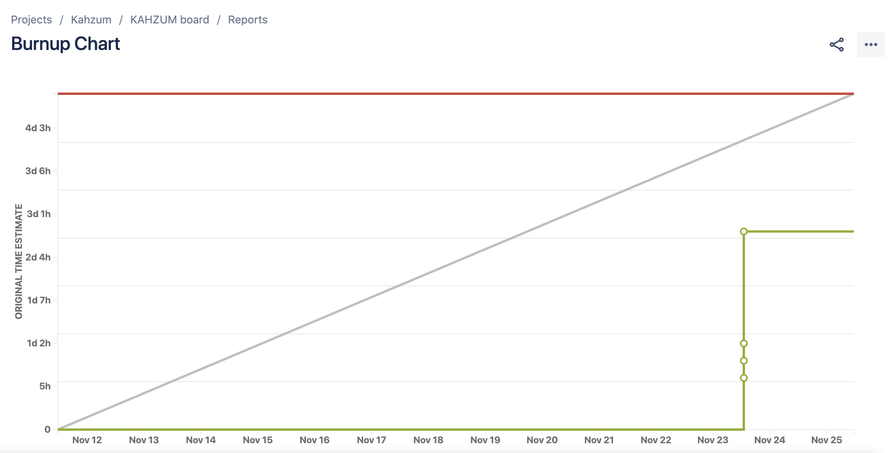

Sprint 3 Report

Kahzum Logistical App, November 23rd, 2020

# Actions to stop doing:

# Actions to start doing:

- Include testing as a part of the development process - concurrently with development.

# Actions to keep doing

- We did a much better job on our tasks and the time it took to complete them

- Documentation is our friend

- Team communication is great

- Running meeting notes

- Meeting structure is informative to all members of the teams

# Work Completed/not completed

## Completed:

- Finish the small business ui - order entry finalized, sign up finalized, business info finalized, order history finalized

- production cluster on mongo

- Dockerize python script

- Bug fixes

- maps urls for routing

## Not Completed:

- twilio - many of the auxiliary actions need to be handled.

- Connect routing algorithm to twilio

# Work completion rate

- Total number of user stories completed: 4

- Total number of estimated ideal work hours: 35-42hrs

  - We just barely didn’t finish the big task so we couldn’t cross it off

- See above bullet point for cumulative hrs/day

    * The red line is the desired user stories to complete based on story points

    * The green line is the completed user stories

    * The gray is the desired velocity of completion
