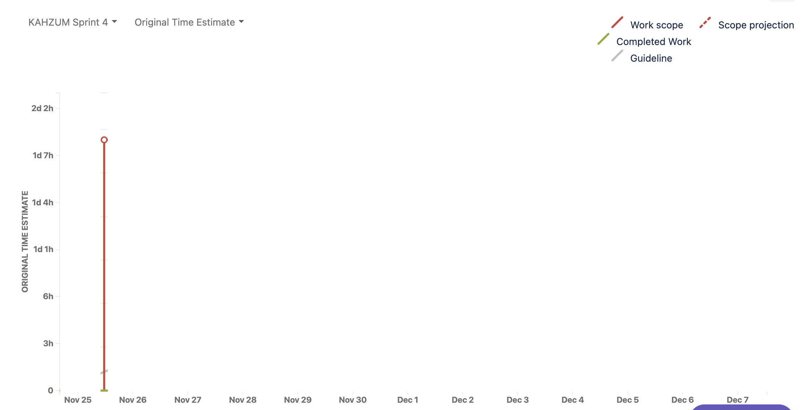
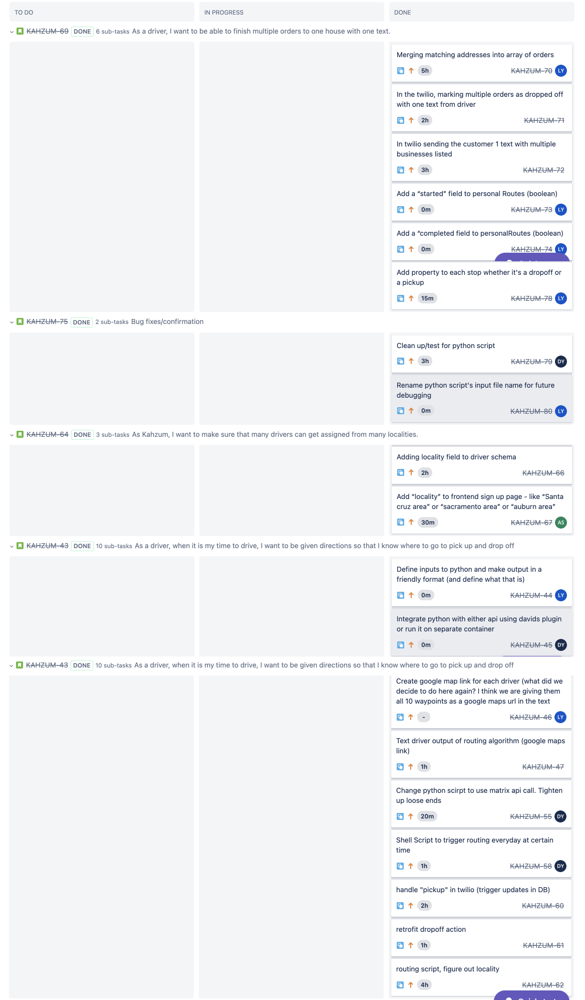

# Sprint 4 Plan

Kahzum Logistical App, November 25th, 2020

### **Sprint ends on December 8th, 2020**

## Goal

- Finalize connection between routing algorithm, twilio, and frontend. Then add localities and run through to test.

## Tasks for this sprint

1. \*As a driver, when it is my time to drive, I want to be given directions so that I know where to go to pick up and drop off. - **\*_ Medium _**

   1. Create google map link for each driver (what did we decide to do here again? I think we are giving them all 10 waypoints as a google maps url in the text right?)

   2. Text driver output of routing algorithm (google maps link)

   3. Shell script to trigger routing every day at x time

   4. twilio texts driver using mongo trigger when the routing script updates the database with that day’s route

   5. handle "pickup" in twilio

   6. retrofit "dropoff" in twilio

2. As Kahzum, I want to make sure that many drivers can get assigned from many localities.

   7. Adding locality field to business

   8. Adding locality field to driver

   9. Add "locality" to frontend sign up page - like “Santa cruz area” or “sacramento area” or “auburn area”

   10. Add to owner settings page

3. As a driver, I want to be able to finish multiple orders to one house with one text.

   11. Merging matching addresses into array of orders

   12. In the twilio, marking multiple orders as dropped off with one text from driver

   13. In twilio sending the customer 1 text with multiple businesses listed

   14. Add a "started" field to personal Routes (boolean)

   15. Add a "completed field to personalRoutes (boolean)

4. Bug fixes/confirmation

   16. When moving into completed orders, add business info instead of object reference

   17. If time: fix mobile for order history page: [https://www.npmjs.com/package/react-screen-orientation](https://www.npmjs.com/package/react-screen-orientation)

IF TIME

5. As a small business owner I want to know if my order could not be delivered and what to do in that case so that I can get it back and handle it myself.

   18. Add to twilio

6. As a customer I want to know when my package is on it’s way and when it will arrive so I know how to time my day to make sure I get the delivery.

## Team Roles

- Product Owner: Mason

- Scrum Master: Langqi

- Team members: Daniel, David, Aidan

## Initial Task Assignments

- Mason: Ensure auto routing is working on production

- Aidan: Add locality to sign in page

- Daniel: work on pickups and dropoffs for twilio with new format

- David: Bug fixes for routing algorithm

- Langqi: Collapse orderids if multiple orders exist at one location.

## Initial Burnup Chart

## Initial Scrum Board

## Scrum Times

### **TA Meeting: **

- Thursday, 2-2:45pm

### **Meetings: **

- Monday, 7:30pm

- Wednesday, 7pm

- Saturday, 7:30pm
