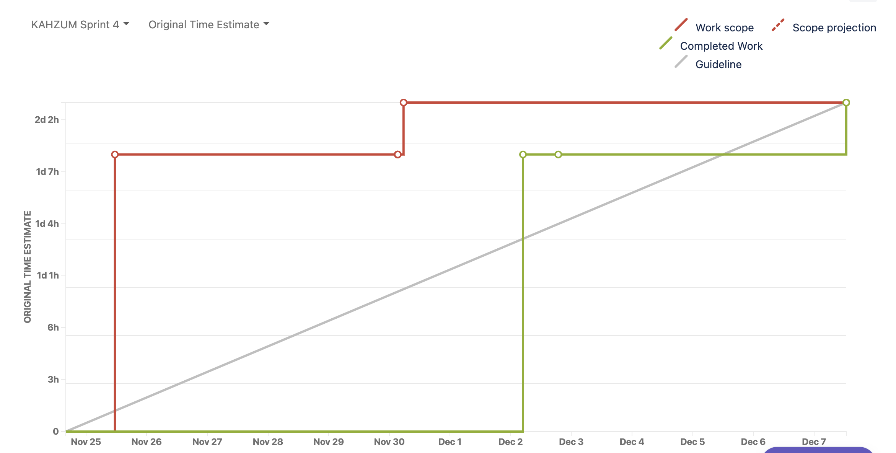

Sprint 4 Report

Kahzum Logistical App, December 7th, 2020

# Actions to stop doing:

- Everything (because we are done with sprinting)

# Actions to start doing:

- Include testing as a part of the development process - concurrently with development.

# Actions to keep doing

- We did a much better job on our tasks and the time it took to complete them

- Documentation is our friend

- Team communication is great

- Running meeting notes

- Meeting structure is informative to all members of the teams

# Work Completed/not completed

## Completed:

- Finish the small business ui - Optimizations for business ui

- Bug fixes

- Twilio flow finished

- Testing db made

- Backend completed

- maps urls for routing

## Not Completed:

- Localities with Python - needs pending order to have locality

# Work completion rate

- Total number of user stories completed: 4

- Total number of estimated ideal work hours: 35-42hrs

- See above bullet point for cumulative hrs/day

    * The red line is the desired user stories to complete based on story points

    * The green line is the completed user stories

    * The gray is the desired velocity of completion
